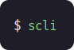

<p align="center">
	
</p>
<h1 align="center">Sinclair-cli</h1>
<p align="center">❄️ A Scala CLI application for controlling Sinclair ACs.<br/><br/><br/></p>

## About

This project is based on [tomikaa87's repo](https://github.com/tomikaa87/gree-remote), I just implemented the code in Scala, and wrote a CLI around it.


## Installation

* **Clone repository**
  
  ```bash
  git clone https://github.com/Tasztalos69/sinclair-cli.git
  ```
* **Stage with [sbt](https://www.scala-sbt.org/)**<br/>
  *The stage command comes from [sbt-native-packager](https://github.com/sbt/sbt-native-packager).*
  
  ```bash
  sbt stage
  ```
* (Alternatively, package it into a compressed archive, debian package or windows installer (requires windows OS))
  ```bash
  sbt universal:packageBin
  
  sbt debian:packageBin
  
  sbt windows:packageBin
  ```
* **Run it**
  
  ```bash
  ./target/universal/stage/bin/scli <command>
  ```


## Usage

You can get detailed usage info by running `scli --help` or `scli <command> --help`.

1. **Search** for available appliances on your network and bind them:  `scli search`
   * The program will try to obtain the default broadcast address.<br/>You can set it explicitly by running `scli config broadcastAddress <ip>`.
   * If more than one device is found, you must explicitly set the default device: `scli devices default <ID>`.  <br/>(Obtain ID by running `scli devices list`)
2. **Control** your appliance: `scli ac [<property>] [<value>]`
   * For available properties and values, run `scli ac --help`.
   * If no arguments provided, the program will print the status of the AC.
3. **Manage devices** previously found by searching: `scli devices <command> [<value>]`
4. **Configure** the CLI: `scli config [<entry>] [<value>]`
   * If no arguments provided, it prints the whole config file.
